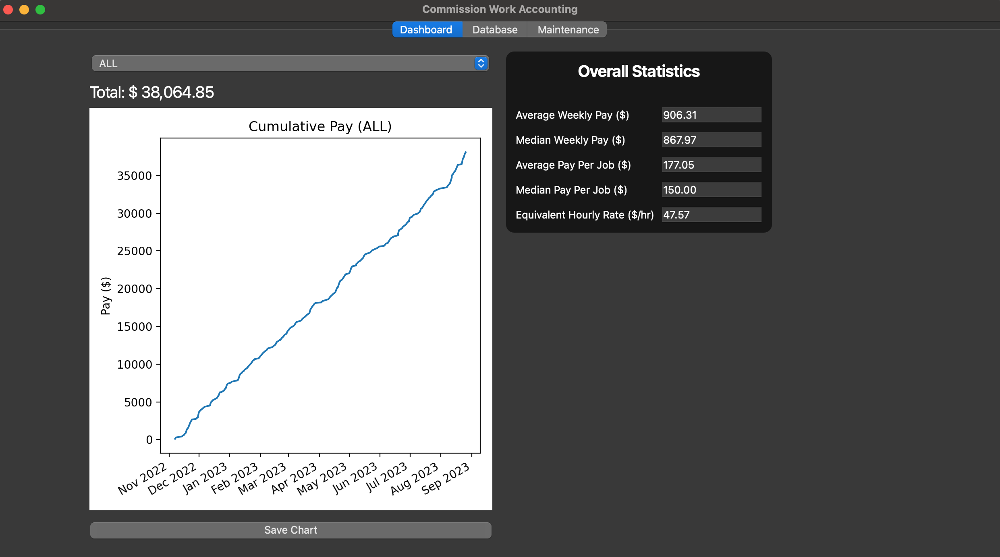
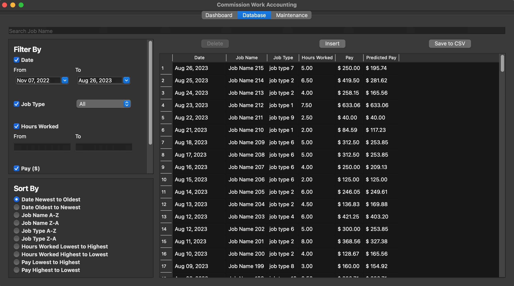
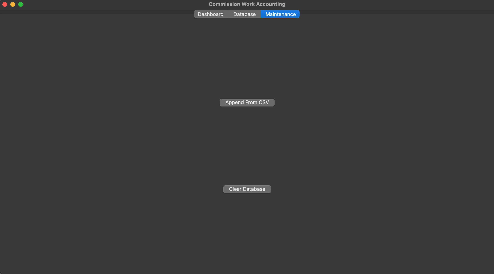

# Commission Work Accounting Application

<p align="left">
  
</p>

<p align="left">
  
</p>

<p align="left">
  
</p>

## The Motivation
Due to the nature of my work being a commission-based role, the pay rate varies, and payment is not immediately released until paycheck day. Previously, I used Excel to track data (date, job name, job type, hours worked, and pay) and calculate the average pay rate to extrapolate future pay. 

After experimenting with machine learning in a separate project, [Machine Learning Research for Commission Work](https://github.com/JC5671/Machine-Learning-Research-for-Commission-Work), I found a strong correlation showing that job type and hours worked can be used to predict future pay, particularly using a Decision Tree Regressor model.

Building on those insights, I decided to create a full [CRUD](https://en.wikipedia.org/wiki/Create,_read,_update_and_delete) application that allows me to log job entries into a custom database interface where I can sort, filter, search, insert, edit, and delete records — all tailored to my workflow. It also generates statistics and charts, and incorporates predictive modeling using a Decision Tree Regressor.

The purpose of this project is twofold: to streamline my personal workflow and to strengthen my technical skills. Along the way, I worked with:
1. Python
2. GUI Development (PyQt6)
3. Machine Learning (scikit-learn Decision Tree Regressor)
4. Database Management (MariaDB and Python MySQL Connector)

## How to Install
### Database Setup
1. **Installing MariaDB**

	This application uses MariaDB. Check out their official website ([https://mariadb.org/](https://mariadb.org/)) on how to install it on your specific OS.

2. **Log in to the Database**

	After installing MariaDB, open up the terminal and type this command along with your password:

	```bash
	sudo mysql -u root -p
	```

	Upon successful login, you should see this screen:
	```console
	jc5671@MC5671:~$ sudo mysql -u root -p
	Enter password: 
	Welcome to the MariaDB monitor.  Commands end with ; or \g.
	Your MariaDB connection id is 314
	Server version: 11.6.2-MariaDB Homebrew

	Copyright (c) 2000, 2018, Oracle, MariaDB Corporation Ab and others.

	Type 'help;' or '\h' for help. Type '\c' to clear the current input statement.

	MariaDB [(none)]> 
	```

3. **Source `databaseSetup.sql`**

	Clone this repository or download as zip. Then you should see `databaseSetup.sql`. Sourcing this will create the necessary database and users to run the application. Replace the filepath with the actual filepath to your `databaseSetup.sql`.

	```console
	MariaDB [(none)]> SOURCE /Users/jc5671/Downloads/CommissionWorkAccounting/databaseSetup.sql
	Query OK, 1 row affected (0.001 sec)

	Database changed
	Query OK, 0 rows affected (0.036 sec)

	Query OK, 0 rows affected, 1 warning (0.001 sec)

	Query OK, 0 rows affected (0.005 sec)
	```

4. **Confirm Database and User Are Ready**

	Make sure that `commissionWorkAccountingDB` appears on the `Database` and `user1` appears on the `User` table.

	```console
	MariaDB [commissionWorkAccountingDB]> SHOW databases;
	+----------------------------+
	| Database                   |
	+----------------------------+
	| commissionWorkAccountingDB |
	| information_schema         |
	| mysql                      |
	| performance_schema         |
	| sys                        |
	| test                       |
	+----------------------------+
	6 rows in set (0.046 sec)

	MariaDB [commissionWorkAccountingDB]> SELECT User, Host FROM mysql.user;
	+-------------+-------------+
	| User        | Host        |
	+-------------+-------------+
	| PUBLIC      |             |
	|             | localhost   |
	| jc5671      | localhost   |
	| mariadb.sys | localhost   |
	| root        | localhost   |
	| user1       | localhost   |
	|             | macmini.lan |
	+-------------+-------------+
	7 rows in set (0.023 sec)
	```

### Python: Virtual Environment Setup and Libraries

The easiest way to run this program is using VS Code.

1. Make sure that Python 3 is installed. [https://www.python.org/](https://www.python.org/).
2. In VS Code, click `File > Open Folder` and open the `CommissionWorkAccountingMain` folder only.
3. Open Command Palette `View > Command Palette`.
4. Search for `Python: Create Environment` and select it. 
5. Select `Venv`.
6. Select the latest Python interpreter.
7. Check the `requirements.txt` and click `ok`.
8. To run it, select `Run > Run Without Debugging` (it might take a while to start the first time).
9. A sample dataset is included in the project's root directory called `Commission Log - obfuscated.csv`. Navigate to the `Maintenance Tab`, click `Append From CSV`, then locate and select `Commission Log - obfuscated.csv`. Now, the database should be populated.

To re-run once everything is installed, repeat steps 1 and 7.

## How It Works
<p align="center">
  
</p>

This data flow diagram shows how each class interacts with each other and the database. Note that this is a high-level view, and it does not show all classes, such as DateEditDelegate and InsertDialog, which are only used in the Database Tab.

### 1. The ML_MODEL
The `ML_MODEL` class predicts pay based on job type and hours worked. While the model was simpler during the research phase, it now incorporates more features to improve performance. These features include:

- **Prediction Cache**

  Since `DatabaseTab.renderTable()` requests ML predictions from `ML_MODEL.predict()` and is called frequently, recalculating predictions for every entry would be inefficient. The Prediction Cache solves this by storing predictions and only computing new ones when necessary.

- **Saving ML Model to File**  

  As the dataset grows, retraining can become expensive. To address this, the trained ML model is saved to a `model.pkl` file. This allows the application to quickly load the model at startup instead of retraining from scratch.

- **Tracking Retrain Load Factor in a Non-Volatile Way**  

  When many rows are inserted or deleted in the database, predictions become less accurate. Retraining after every change would also be inefficient. To balance accuracy and efficiency, the application tracks the number of database changes since the last ML training (let's call it "retrain load factor") in `modelConfig.json`. If 20% or more of the database rows have been altered, the model is retrained. This is closely tied to the `model.pkl` file, so it has to be non-volatile.

- **Improved `ML_MODEL.predict()` Method**  

  The `ML_MODEL.predict()` method is the main interface between the `ML_MODEL` class and `DatabaseTab` class. It now handles loading the model, retraining, and generating predictions. Depending on the state of the database and program, there are three main scenarios:

  1. **Significant database changes (retrain load factor > 20%)**  
     - If 20% or more of the entries have changed, the model is retrained to ensure accurate predictions.  
     - All predictions are then generated and cached, and the predictions for the requested IDs are returned.

  2. **First-time startup or after `ML_MODEL.reset()`**  
     - The method attempts to load a saved model from `model.pkl`.  
     - If no model exists, a full training run is performed.
     - All predictions are then generated and cached, and the predictions for the requested IDs are returned.

  3. **Normal operation: Predict only what is necessary**  
     - Only IDs not present in the prediction cache are predicted.  
     - Predictions are cached, and the predictions for the requested IDs are returned.

  This design ensures predictions are both accurate and efficient, minimizing unnecessary retraining while keeping the cache up to date.

### 2. The Dashboard Tab
<p align="left">
  
</p>

The dashboard tab's job is to pull data from the database and display it as a chart and summary statistics.

- **Charting**
	
	The chart shows the date in the x-axis and cumulative pay in the y-axis. To achieve this, it pulls job_date and job_pay from the database in ascending order, seperate the two, reformat the pay to be cumulative in python, and finally plot it with matplotlib. 
	
	Additionally, it displays the final cumulative pay, has a button to save the chart to SVG, and it also has a dropdown option to select an interval. The dropdown option includes ALL, YTD, and other years that are available from the database. Depending on the selected dropdown interval, the SQL query may vary:
	
	- For ALL
	
		```sql
		SELECT job_date, pay FROM jobs ORDER BY job_date ASC
		```

	- For YTD (year-to-date)

		```sql
		SELECT job_date, pay FROM jobs WHERE job_date >= MAKEDATE(YEAR(CURDATE()), 1) ORDER BY job_date ASC
		```
	
	- For individual year

		```sql
		SELECT job_date, pay FROM jobs WHERE year(job_date) = %s ORDER BY job_date ASC
		```

- **Statistics**

	The statistics show the weekly pay, pay per job, and equivalent hourly rate. To achieve this, it retrieves the data from the database in different queries, then does quick numpy operations like `np.average()` and `np.median()`. 

	- For Weekly Pay

		```sql
		SELECT SUM(pay) FROM jobs GROUP BY YEARWEEK(job_date)
		```

		Then, process the data and take the `np.average()` and `np.median()`.
	
	- For Pay Per Job
	
		```sql
		SELECT pay FROM jobs
		```

		Then, process the data and take the `np.average()` and `np.median()`.
	
	- For Equivalent Hourly Rate
	
		```sql
		SELECT SUM(pay), SUM(hours_worked) FROM jobs
		```
		
		Then, process the data and divide `SUM(pay)` by `SUM(hours_worked)` to get `hourly rate`.

### 3. The Database Tab
<p align="left">
  
</p>

The Database Tab is a [CRUD](https://en.wikipedia.org/wiki/Create,_read,_update_and_delete) page for the user to interact with the database. It provides error checkings to make sure the data type is compatible with the ones in the database. In addition to [CRUD](https://en.wikipedia.org/wiki/Create,_read,_update_and_delete), the Database Tab interacts with the ML_MODEL to create the predictions column. However, at its core, the Database Tab boils down to these 4 SQL queries (Note: `%s` is a placeholder that Python MySQL Connector uses):

- **INSERT**

	Inserting a new entry is really straightforward. Once entry is checked and error-free, Python MySQL Connector executes this query:

	```sql
	INSERT INTO jobs (job_date, job_name, job_type, hours_worked, pay) VALUES (%s, %s, %s, %s, %s)
	```

- **SELECT**
	
	- **Searching**

		In searching, `LIKE` is added to the query `SELECT * FROM jobs WHERE` resulting in:

		```sql 
		SELECT * FROM jobs WHERE LOWER(job_name) LIKE %s
		```
	
	- **Filtering**

		In filtering, conditions are added using `AND` to the query `SELECT * FROM jobs WHERE`. All the conditions can coexist at the same time. Those conditions are:

		```sql 
		job_date BETWEEN %s AND %s
		```

		```sql 
		job_type = %s
		```

		```sql 
		hours_worked >= %s
		```

		```sql 
		hours_worked <= %s
		```

		```sql 
		pay >= %s
		```

		```sql 
		pay <= %s
		```

	- **Sorting**

		In sorting, `ORDER BY` is used along with the column name and either `ASC` or `DESC`. For example, the default ordering is:

		```sql 
		SELECT * FROM jobs ORDER BY job_date DESC
		```

		But any column can be used to sort the table in ascending or descending order.
	
- **UPDATE**

	Updating a cell in the PyQt6 GUI table is a little tricky. It involves keeping track of the ID in the table cell, even though it is not displayed. However, once the cell that is being updated is checked and error-free, the Python MySQL Connector executes this query:

	```sql
	UPDATE jobs SET column_name = %s WHERE id = %s
	```

- **DELETE**

	Similar to `UPDATE`, `DELETE` uses the ID that is kept hidden in the table cell to delete that entry from the database. The difference is that `DELETE` can delete multiple entries. The SQL query looks like this, depending on how many items to delete:

	```sql
	DELETE FROM jobs WHERE id IN (%s, %s, %s)
	```

### 4. The Maintenance Tab

<p align="left">
  
</p>

The Maintenance Tab is the simplest tab. Its purposes are 
- **Append to the database from CSV**

	Read the CSV file and insert entries one by one.

	```sql
	INSERT INTO jobs (job_date, job_name, job_type, hours_worked, pay) VALUES (%s, %s, %s, %s, %s)
	```

- **Clear out all the entries from the database**

	```sql
	DELETE FROM jobs
	ALTER TABLE jobs AUTO_INCREMENT = 1 /* Resets the ID counter*/
	```